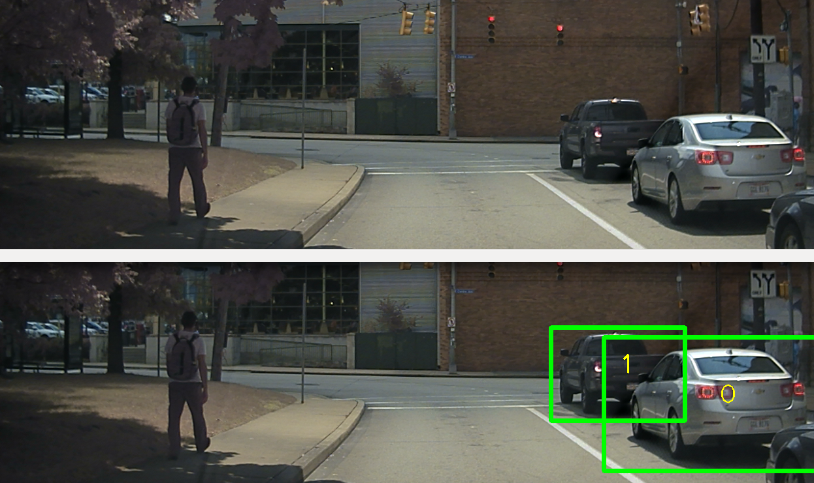

# Detect-it Challenge



---
## Challenge
You are given:

1. `img` - an input image with vehicles
2. `detections` - a list of detections resulting from a vehicle detection algorithm.

Each item in the list is a 5-tuple that describe a rectangle in the image coordinates, along with its confidence measure, a number between 0 and 1.
For example, this detection:
```
0.816 962 169 153 256
```
has a:
* confidence = 0.816
* top-left point: (x=962, y=169)
* dimensions: (width=153, height=256)


## Goal
Your task is to implement an `aggregate` function that takes the detections list as an argument, and returns a list of rectangles around each object in the image.
Each object should have **only one** bounding rectangle around it.

pseudocode:
```
list<Rect> cars = aggregate(detections) {
    // your solution here
}
```


## Instructions

Write a program that implements the `aggregate` function. Your program should read a file from `input/` folder and save the result to `solution/` folder,
in similar format to the files in `output/` folder, i.e: a space separated 4-tuple (x y width height), each item in a new line. Send us your code, and the output it generated.

### Challenge

In some of the examples, our version of the algorithm grouped more than one vehicle into one object (see `img/2.png`, `img/3.png`). Can you do better?
* Please submit the first version of your code that mostly works, and tell us roughly how long you spent on it.
* If you continue to try and get better solutions, please send new versions whenever you have something that is different in some interesting way. Different algorithm,
    different results, whatever you think is interesting. But it is not necessary to do better than we did. So don't spend too much time on this.
